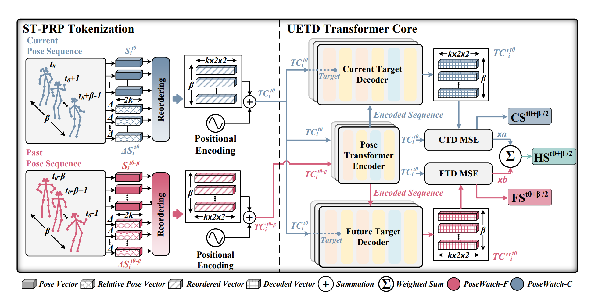

# 🌟 SPARTA: Human-Centric Video Anomaly Detection

## 🔍 Overview

📄 **ArXiv Paper:** [Human-Centric Video Anomaly Detection Through Spatio-Temporal Pose Tokenization and Transformer](https://arxiv.org/abs/2408.15185)


SPARTA is an advanced approach for **Human-Centric Video Anomaly Detection** that leverages **Spatio-Temporal Pose and Relative Pose (ST-PRP) tokenization** and a **transformer-based architecture**. This repository provides the implementation of **SPARTA**, introducing an innovative **Unified Encoder Twin Decoders (UETD) Transformer** to enhance anomaly detection in human activity videos.

This method outperforms existing pose-based anomaly detection techniques and competes with pixel-based approaches while ensuring **better privacy and lower bias**.

---
## 🚀 Features
✅ **Spatio-Temporal Pose and Relative Pose (ST-PRP) Tokenization**  
✅ **Unified Encoder Twin Decoders (UETD) Transformer Architecture**  
✅ **State-of-the-Art Performance on Benchmark Datasets**  
✅ **Self-Supervised Learning for Robust Generalization**  

---
## 🔧 Model Architecture
SPARTA consists of:

1️⃣ **ST-PRP Tokenization** - A novel method for encoding human motion.  
2️⃣ **UETD Transformer Core** - A unified encoder with twin decoders for self-supervised anomaly detection:
   - 🟢 **Current Target Decoder (CTD)**
   - 🔵 **Future Target Decoder (FTD)**

### 🔹 Figure 1: SPARTA Architecture


---
## 📊 Experimental Results
### Table 1: Performance Comparison with Pose-Based Methods (AUC-ROC %)
| Method | SHT | HR-SHT | CHAD | NWPUC | Avg. |
|--------|------|--------|------|------|------|
| STG-NF | 85.90 | 87.40 | 60.60 | 62.56 | 74.11 |
| SPARTA-C | 85.10 | 86.70 | 66.12 | 62.69 | 75.15 |
| SPARTA-F | 83.19 | 83.70 | 66.61 | 62.29 | 73.94 |
| **SPARTA-H** | **85.75** | **87.23** | **67.04** | **63.48** | **75.87** |

---
## 📂 Datasets
SPARTA has been evaluated on the following benchmark datasets:

📌 **ShanghaiTech Campus (SHT)**  
📌 **HR-ShanghaiTech (HR-SHT)**  
📌 **Charlotte Anomaly Dataset (CHAD)**  
📌 **Northwestern Polytechnical University Campus (NWPUC)**  

👉 **Preprocessed dataset links:** [Dataset Access Here](#)

---
## 🎯 Training and Evaluation
Each branch of SPARTA needs to be trained separately. **CTD must be trained first**, as its encoder is reused in the FTD branch.

### **Train CTD Branch**
```bash
python3 main.py --dataset [dataset_name] --branch SPARTA_C \
--mask_root [frame_level_mask_directory] --vid_res [dataset_resolution] \
--seg_len [window_size_1s] --seg_stride 12 --num_kp 18 \
--model_num_heads 12 --model_num_layers 4 --relative \
--model_loss mse --token_config pst --batch_size 512 --model_latent_dim 64
```

### **Train FTD Branch**
```bash
python3 main.py --dataset [dataset_name] --branch SPARTA_F \
--mask_root [frame_level_mask_directory] --vid_res [dataset_resolution] \
--seg_len [window_size_1s] --seg_stride 12 --num_kp 18 \
--model_num_heads 12 --model_num_layers 4 --relative \
--model_loss mse --token_config pst --batch_size 512 \
--model_latent_dim 64 --recon_encoder_path [trained_CTD_path]
```

### **Evaluation**
```bash
python3 main.py --dataset [dataset_name] --branch SPARTA_H \
--model_ckpt_C [trained_CTD_path] --model_ckpt_F [trained_FTD_path] \
--mask_root [frame_level_mask_directory] --vid_res [dataset_resolution] \
--seg_len [window_size_1s] --seg_stride 12 --num_kp 18 \
--model_num_heads 12 --model_num_layers 4 --relative \
--model_loss mse --token_config pst --batch_size 512 --model_latent_dim 64
```

---
## 📜 Citation
If you find this work useful, please cite:
```bibtex
@misc{noghre2025humancentricvideoanomalydetection,
  title={Human-Centric Video Anomaly Detection Through Spatio-Temporal Pose Tokenization and Transformer}, 
  author={Ghazal Alinezhad Noghre and Armin Danesh Pazho and Hamed Tabkhi},
  year={2025},
  eprint={2408.15185},
  archivePrefix={arXiv},
  primaryClass={cs.CV},
  url={https://arxiv.org/abs/2408.15185}, 
}
```

---
## 📬 Contact
For inquiries or collaborations, feel free to reach out to:
📩 **Ghazal Noghre** - [galinezh@charlotte.com](mailto:galinezh@charlotte.com)  
💬 **GitHub Issues** - [Open an Issue](#)

---
Thank you for exploring **SPARTA**! 🎥🚀 Your contributions and feedback are always welcome! 🎯

